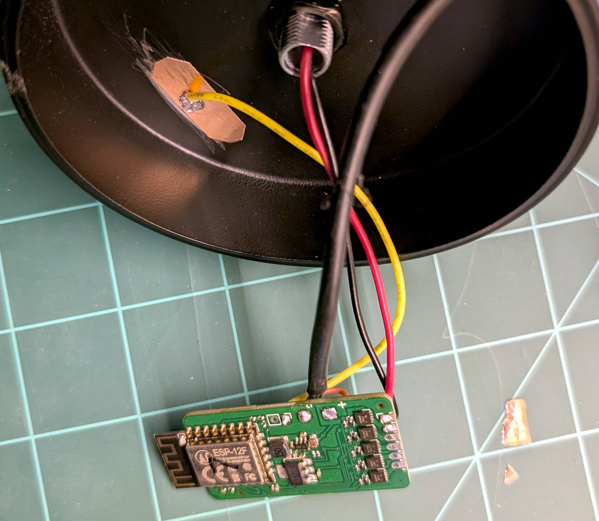
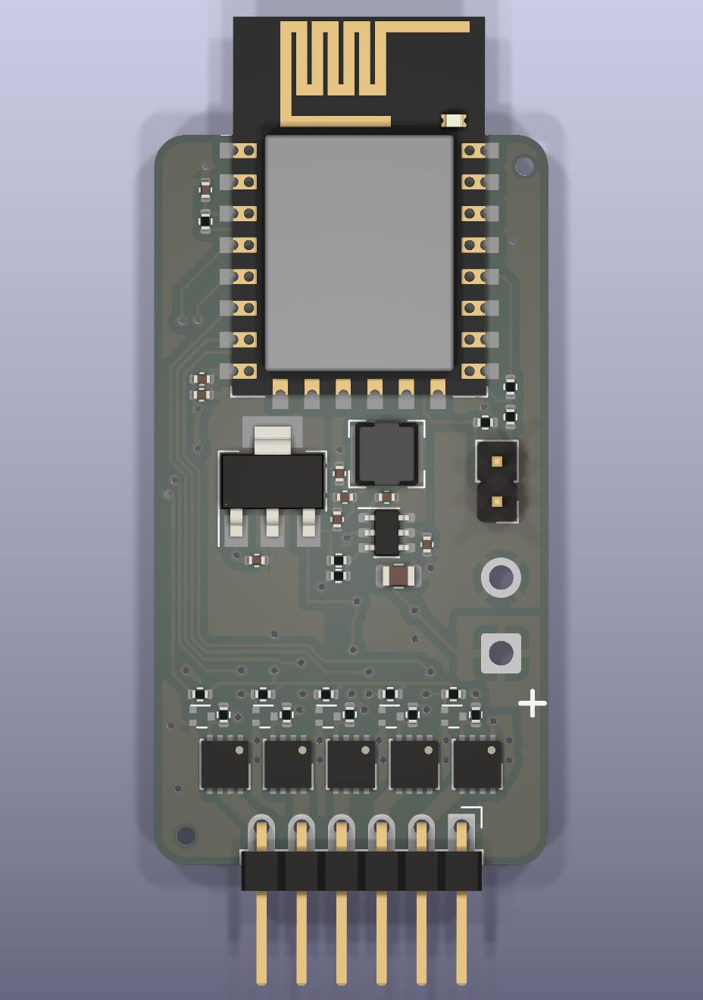
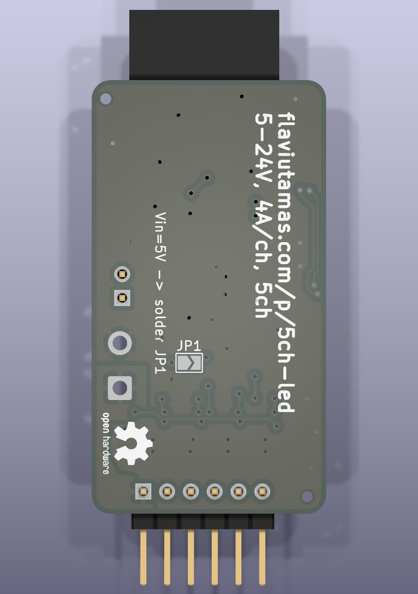

# IoT RGBWW strip dimmer

Designed for use with ESPHome, this project is a compact & powerful dimmer for all LED strips. The primary goal was low cost, in the most compact package possible. For scale, the picture above was taken on a 1 inch grid.

This is intended as a substitute for the poorly-designed Magic Home LED strip controllers.

Note: the yellow wire in the photo does not work as a capacitive touch sensor, that was a failed experiment.

## Features

- Up to 5 lighting channels
- Support for voltages between 5V and 24V
- Up to 4A per channel. Outputs can be paralleled.
- Reasonable efficiency: approx. 200mW standby power draw.
- Low cost, PCB is about $4.50/ea manufactured.

## Description

[Schematic](./docs/schematic.pdf)